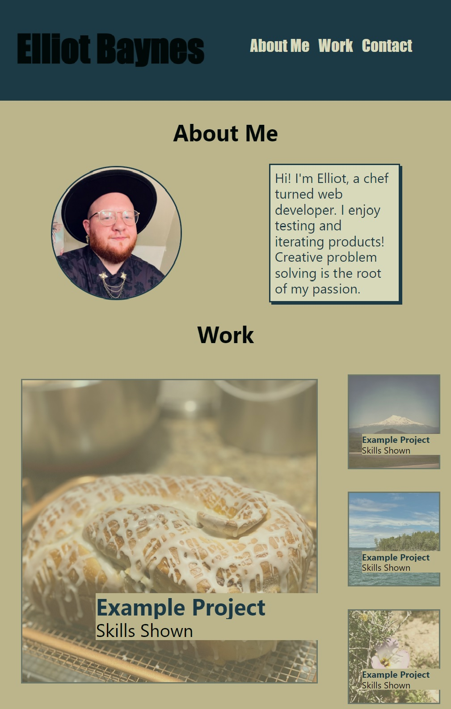

# Web Portfolio

## Objective

Create a mock portfolio webpage where I can eventually add completed projects

## Project Rundown

- Created core structure in HTML
- Used **stand-in photos** for projects- nothing to add at the moment
- Used mobile-first design process to implement styling
- Links in CONTACT will eventually link to github and linkedin when applicable

## Mock Up

## View Deployed Project Here

https://eabaynes.github.io/Web-Portfolio/
